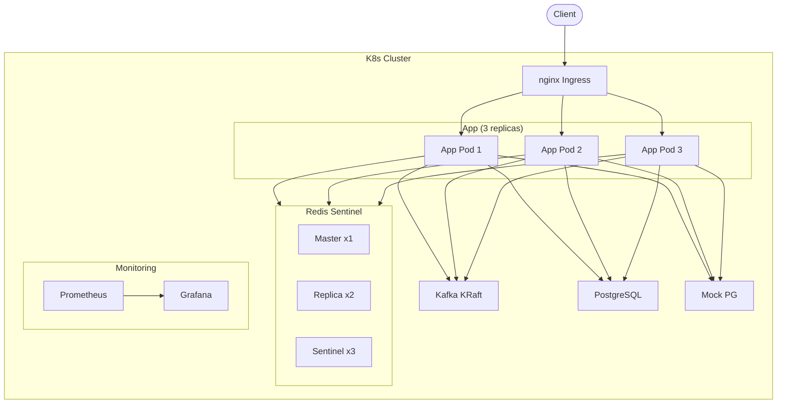
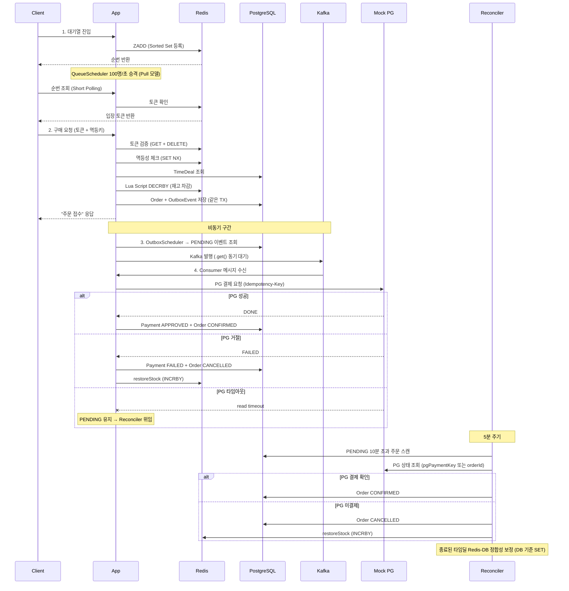

# Flash Sale - 타임세일 정합성 보장 시스템

대량 동시 요청에서 **재고 초과 판매(Over-selling) 0건**을 보장하는 타임세일 시스템.

## 핵심 성과
- Over-selling: **0건** (1,000 VU × 60초, 재고 1,000개)
- Redis 전체 장애 시: DB Fallback으로 구매 지속
- K8s 3 replicas 다중 인스턴스에서도 동일 보장
- p95 응답시간: 43ms

## 해결한 문제
타임세일처럼 짧은 시간에 트래픽이 집중되는 환경에서 세 구간의 정합성 위협을 해결:
1. **재고 예약** — Redis Lua Script 원자적 차감 + CB Fallback
2. **결제** — Outbox 패턴 + Kafka 비동기 + PG 타임아웃 PENDING 유지
3. **보상** — 3계층 방어 (실시간 INCRBY → CompensationFailure 추적 → warm-up/Reconciler)

> 각 위협(F1~F9)의 상세 분석: [docs/consistency-design.md](docs/consistency-design.md)

## 아키텍처



## 요청 흐름



## 기술 스택

| 분류 | 기술 |
|------|------|
| Language | Java 21 (Virtual Thread) |
| Framework | Spring Boot 3.5.12 |
| DB | PostgreSQL 18 |
| Cache | Redis 8 Sentinel (Master 1 + Replica 2 + Sentinel 3) |
| Messaging | Kafka 4.0 KRaft |
| Resilience | Resilience4j Circuit Breaker |
| PG | Mock PG (토스페이먼츠 API 스펙 기반) |
| Load Test | k6 |
| Monitoring | Prometheus + Grafana |
| Container | Docker Compose / K8s (Kind + nginx Ingress) |

## 정합성 설계

| ID | 시나리오 | 해결 | 상세 |
|----|---------|------|------|
| F1 | Redis 차감 성공 + DB 실패 | 3계층 보상 (INCRBY → CompensationFailure → warm-up/Reconciler) | [상세](docs/consistency-design.md#f1-redis-차감-성공--db-실패) |
| F2 | Redis 장애 | CB → DB Fallback + 복구 시 SSOT(DB) 기준 동기화 | [상세](docs/consistency-design.md#f2-redis-실패--db-성공) |
| F3 | 응답 실패 (재시도) | 멱등성 키 (Redis SET NX + DB UNIQUE) | [상세](docs/consistency-design.md#f3-둘-다-성공--응답-실패-클라이언트-재시도) |
| F4 | Redis 자체 장애 | 토큰 skip + 멱등성 skip + CB → DB Fallback | [상세](docs/consistency-design.md#f4-redis-자체-장애) |
| F5 | Replication Lag | 발생 안 함 (Lua Script는 Master 실행) | - |
| F6 | Kafka 발행 실패 | Outbox 패턴 (같은 TX 저장 → Scheduler polling) | [상세](docs/consistency-design.md#f6-db-성공--kafka-발행-실패) |
| F7 | Consumer 처리 실패 | offset 미커밋 재전송 + Consumer 멱등성 + PG 멱등성 | [상세](docs/consistency-design.md#f7-kafka-consumer-처리-실패) |
| F8 | PG 타임아웃 | PENDING 유지 → Reconciler orderId 조회 | [상세](docs/consistency-design.md#f8-pg-결제-결과-불확실-타임아웃--reconciler-사후-처리) |
| F9 | 보상 트랜잭션 실패 | CompensationFailure 추적 → Scheduler 재시도 → warm-up/Reconciler | [상세](docs/consistency-design.md#f9-보상-트랜잭션-실패) |

> 3계층 정합성 방어: 실시간 보상(INCRBY) → CompensationFailure 추적+재시도 → warm-up(SET NX)+종료 후 Reconciler

## 검증 결과

| 시나리오 | 조건 | 결과 | 지표 |
|---------|------|------|------|
| Over-selling | 1,000 VU × 60s, 재고 1,000 | **0건** | p95 43ms, 2,433 RPS |
| Redis 장애 Fallback | Redis 전체 다운 (docker stop) | DB Fallback 구매 성공 | CB → DB atomic UPDATE |
| 결제 실패 보상 | Mock PG failRate 100% | CANCELLED + 재고 복원 | Payment FAILED, Redis INCRBY |
| PG 타임아웃 (미결제) | read timeout 5초, PG timeout | Reconciler → 취소 + 복원 | orderId 조회 → NOT_FOUND |
| PG 타임아웃 (실제결제) | PG 6초 지연 (> 5초 timeout) | Reconciler → 주문 확정 | orderId 조회 → DONE |
| Reconciler 보정 | Redis 재고 의도적 불일치 | 종료 후 DB 기준 보정 | redis 10 → 7 |
| K8s 다중 인스턴스 | 3 replicas, 1,000 VU × 60s | **Over-selling 0건** | 154K req, 2,433 RPS |

## 프로젝트 구조

```
src/main/java/com/flashsale/
├── common/          # 공통 (에러 처리, 설정, warm-up)
├── timedeal/        # 타임딜 도메인 (재고 차감, CB Fallback)
├── queue/           # 대기열 (Sorted Set, Pull Scheduler)
├── purchase/        # 구매 (멱등성, 토큰 검증, Outbox 저장)
├── order/           # 주문 도메인
├── payment/         # 결제 (PG 추상화, Kafka Consumer)
├── outbox/          # Outbox 패턴 (이벤트, Scheduler)
└── reconciler/      # 정합성 보정 (Stock, Pending, Compensation)

k6/                  # 부하 테스트 스크립트
k8s/                 # K8s 매니페스트
docker/              # Redis Sentinel 설정
monitoring/          # Prometheus + Grafana 설정
```

## 실행 방법

### Docker Compose

```bash
docker compose up --build -d
```

14개 컨테이너: app, mock-pg, postgresql, redis-master, redis-replica1/2, redis-sentinel1/2/3, kafka, prometheus, grafana, redis-exporter, postgres-exporter

### K8s (Kind)

```bash
# 클러스터 생성
kind create cluster --name flash-sale --config k8s/kind-config.yaml

# nginx Ingress 설치
kubectl apply -f https://raw.githubusercontent.com/kubernetes/ingress-nginx/main/deploy/static/provider/kind/deploy.yaml

# 이미지 빌드 + Kind 로드
docker build -t flash-sale-app:latest .
docker build -t flash-sale-mock-pg:latest ../flash-sale-mock-pg
kind load docker-image flash-sale-app:latest --name flash-sale
kind load docker-image flash-sale-mock-pg:latest --name flash-sale

# 전체 배포
kubectl apply -f k8s/namespace.yaml
kubectl apply -f k8s/postgresql.yaml
kubectl apply -f k8s/redis.yaml
kubectl apply -f k8s/kafka.yaml
kubectl apply -f k8s/mock-pg.yaml
kubectl apply -f k8s/app.yaml
kubectl apply -f k8s/ingress.yaml
```

12개 Pod: app(3), postgresql(1), redis-master(1), redis-replica(2), redis-sentinel(3), kafka(1), mock-pg(1)

### k6 부하 테스트

```bash
# Docker Compose
k6 run -e TOTAL_STOCK=1000 k6/full-flow-test.js

# K8s (Ingress)
k6 run -e BASE_URL=http://localhost -e TOTAL_STOCK=1000 k6/full-flow-load-test.js
```

## API

| Method | Path | 설명 |
|--------|------|------|
| POST | /api/v1/admin/time-deals | 타임딜 생성 |
| GET | /api/v1/admin/time-deals/{id} | 타임딜 조회 |
| POST | /api/v1/queue/enter | 대기열 진입 |
| GET | /api/v1/queue/position | 순번 조회 (토큰 발급) |
| POST | /api/v1/purchase | 구매 요청 |

Swagger UI: `http://localhost:8080/swagger-ui.html`

## 설계 과정에서 발견한 핵심 문제들

### 1. Circuit Breaker self-invocation
같은 클래스 내에서 `@CircuitBreaker` 메서드를 호출하면 AOP 프록시를 타지 않아 CB가 동작하지 않는다. `RedisStockClient`로 분리하여 해결.

### 2. Reconciler 활성 판매 중 보정의 위험
Redis-DB 총량 비교로 보정하면 in-flight 주문의 재고 차감을 되돌려 Over-selling이 발생할 수 있다. 활성 중에는 모니터링만, 종료 후 강제 보정으로 해결.

### 3. PG 타임아웃 시 즉시 취소의 위험
PG가 실제로 결제를 처리했을 수 있으므로 즉시 CANCELLED로 바꾸면 안 된다. PENDING을 유지하고 Reconciler가 orderId로 PG에 조회하여 확정 또는 취소를 판단.

### 4. warm-up 다중 인스턴스 race condition
여러 Pod이 동시에 시작할 때 warm-up이 Redis를 덮어쓰면 다른 Pod의 in-flight 주문을 무효화할 수 있다. SET NX(키가 없을 때만 적재)로 해결.

### 5. 다중 인스턴스 Scheduler 중복 실행
OutboxScheduler, QueueScheduler, Reconciler가 모든 Pod에서 동시에 실행되면 같은 이벤트를 중복 처리할 수 있다. 현재는 Consumer 멱등성과 @Transactional로 방어하지만, 프로덕션에서는 분산 락 또는 리더 선출이 필요하다.
