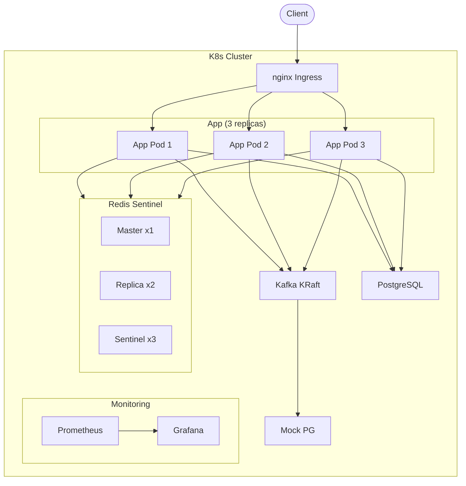
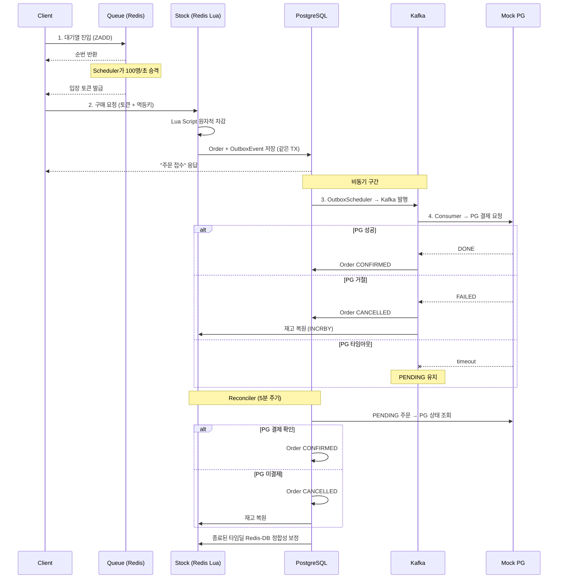
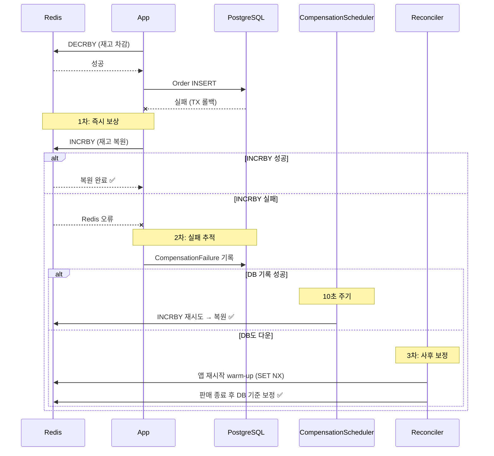

# Flash Sale - 타임세일 정합성 보장 시스템

대량 동시 요청 환경에서 **Over-selling 0건**을 보장하는 타임세일 시스템.
Redis Lua Script 원자적 재고 차감, Kafka 비동기 결제, 3계층 정합성 방어를 통해 실무 수준의 동시성 제어를 구현했다.

## 아키텍처



## 요청 흐름

```
사용자 요청
    │
    ▼
[1단계: 트래픽 관리]
  대기열 (Redis Sorted Set + Pull 모델)
  입장 토큰 (1회용, TTL 5분)
    │ 100명/초 제어된 트래픽
    ▼
[2단계: 재고 예약]
  Redis Lua Script (원자적 차감)
  멱등성 키 (Redis SET NX + DB UNIQUE)
  ── Redis 장애 시: Circuit Breaker → DB Fallback
    │
    ▼
[3단계: 주문+결제 (비동기)]
  Outbox 패턴 (DB TX → Scheduler → Kafka)
  Consumer: PG 결제 → 주문 확정
  PG 타임아웃 → PENDING 유지 → Reconciler 사후 처리
```



## 기술 스택

| 분류 | 기술 |
|------|------|
| Language | Java 21 (Virtual Thread) |
| Framework | Spring Boot 3.5 |
| DB | PostgreSQL 18 |
| Cache | Redis 8 Sentinel (Master 1 + Replica 2 + Sentinel 3) |
| Messaging | Kafka 4.0 KRaft |
| Resilience | Resilience4j Circuit Breaker |
| PG | Mock PG (토스페이먼츠 API 스펙 기반) |
| Load Test | k6 |
| Monitoring | Prometheus + Grafana |
| Container | Docker Compose / K8s (Kind + nginx Ingress) |

## 정합성 위협 맵 (F1~F9)

### 2단계: 재고 예약

#### F1. Redis 차감 성공 + DB 실패



<details>
<summary>텍스트 버전 (비교용)</summary>

```
F1. Redis 차감 성공 + DB 실패
    │
    ├─ 1차: try-catch에서 Redis INCRBY 즉시 복원
    │   ├─ 성공 → 정합성 유지 ✅
    │   └─ 실패 ──→ 2차: CompensationFailure 테이블에 기록
    │                 ├─ 성공 → 10초 주기 Scheduler가 재시도 → 복원 ✅
    │                 └─ 실패 (DB 다운) ──→ 3차: 앱 재시작 시 warm-up(SET NX)
    │                                         + 판매 종료 후 Reconciler 보정 ✅
```
</details>
    │
F2. Redis 실패 + DB 성공
    └─ 발생 안 함: Redis를 먼저 차감하므로 Redis 실패 시 DB까지 안 감
    │
F3. 둘 다 성공 + 응답 실패 (클라이언트 재시도)
    └─ 멱등성 키로 중복 차단
       ├─ Redis SET NX: 1차 방어 (같은 키 존재 시 기존 주문 반환)
       └─ DB UNIQUE: 2차 방어 (Redis 장애 시에도 중복 INSERT 차단)
    │
F4. Redis 자체 장애
    ├─ 토큰 검증: Redis GET 실패 → skip (WARN 로그)
    ├─ 멱등성 체크: Redis SET NX 실패 → skip (DB UNIQUE 방어)
    ├─ 재고 차감: Circuit Breaker OPEN → DB atomic UPDATE Fallback
    └─ 대기열이 동시접속을 100명/초로 제한하므로 DB 부하 감당 가능 ✅
    │
F5. Replication Lag (Replica 읽기로 초과 차감)
    └─ 발생 안 함: Lua Script는 Master에서 실행, Sentinel 환경에서 Replica 읽기 없음
```

### 3단계: 주문+결제 (비동기)

```
F6. DB 성공 + Kafka 발행 실패
    └─ Outbox 패턴: 같은 TX에서 Order + OutboxEvent 저장
       → OutboxScheduler가 PENDING 이벤트 polling → Kafka 발행
       → 발행 실패 시 retryCount 증가, 5회 초과 시 FAILED ✅
    │
F7. Kafka Consumer 처리 실패
    ├─ offset 미커밋 → 자동 재전송 (at-least-once)
    ├─ Consumer 멱등성: Order 상태 체크 + Payment 중복 체크
    └─ PG 멱등성: Idempotency-Key 헤더로 이중 결제 방지 ✅
    │
F8. PG 결제 결과 불확실 (타임아웃)
    ├─ PG 명시적 거절 → Payment FAILED + Order CANCELLED + 재고 복원 ✅
    └─ PG 타임아웃 (처리 여부 불명)
       → PENDING 유지 (섣불리 취소하지 않음)
       → PendingOrderReconciler가 orderId로 PG 조회
          ├─ PG "DONE" → 주문 확정 (pgPaymentKey 획득) ✅
          └─ PG "NOT_FOUND" → 주문 취소 + 재고 복원 ✅
    │
F9. 보상 트랜잭션 실패
    ├─ INCRBY 복원 실패 → CompensationFailure 기록 → Scheduler 재시도
    ├─ DB 다운으로 기록 불가 → warm-up + 종료 후 Reconciler
    └─ 앱 크래시 → warm-up (SET NX) + 종료 후 Reconciler ✅
```

### 횡단: 3계층 정합성 방어

```
1층: 실시간 보상 (INCRBY)                → 99% 커버
2층: CompensationFailure 추적 + 재시도    → 보상 실패 시
3층: warm-up(SET NX) + 종료 후 Reconciler → 앱 크래시, DB 다운, Redis Failover
```

## 검증 결과

| 시나리오 | 조건 | 결과 |
|---------|------|------|
| Over-selling | 1,000 VU, 재고 1,000 | **0건** |
| Redis 장애 Fallback | Redis 전체 다운 | DB Fallback으로 구매 성공 |
| 결제 실패 보상 | PG failRate 100% | CANCELLED + 재고 복원 |
| PG 타임아웃 (미결제) | read timeout 5초 초과 | Reconciler → 취소 + 재고 복원 |
| PG 타임아웃 (실제결제) | PG 6초 지연 | Reconciler → 주문 확정 |
| Reconciler 보정 | Redis-DB 불일치 | 종료 후 DB 기준 강제 보정 |
| K8s 다중 인스턴스 | 3 replicas, 1,000 VU | **Over-selling 0건** |

## 실행 방법

### Docker Compose

```bash
docker compose up --build -d
```

14개 컨테이너: app, mock-pg, postgresql, redis-master, redis-replica1/2, redis-sentinel1/2/3, kafka, prometheus, grafana, redis-exporter, postgres-exporter

### K8s (Kind)

```bash
# 클러스터 생성
kind create cluster --name flash-sale --config k8s/kind-config.yaml

# nginx Ingress 설치
kubectl apply -f https://raw.githubusercontent.com/kubernetes/ingress-nginx/main/deploy/static/provider/kind/deploy.yaml

# 이미지 빌드 + Kind 로드
docker build -t flash-sale-app:latest .
docker build -t flash-sale-mock-pg:latest ../flash-sale-mock-pg
kind load docker-image flash-sale-app:latest --name flash-sale
kind load docker-image flash-sale-mock-pg:latest --name flash-sale

# 전체 배포
kubectl apply -f k8s/namespace.yaml
kubectl apply -f k8s/postgresql.yaml
kubectl apply -f k8s/redis.yaml
kubectl apply -f k8s/kafka.yaml
kubectl apply -f k8s/mock-pg.yaml
kubectl apply -f k8s/app.yaml
kubectl apply -f k8s/ingress.yaml
```

12개 Pod: app(3), postgresql(1), redis-master(1), redis-replica(2), redis-sentinel(3), kafka(1), mock-pg(1)

### k6 부하 테스트

```bash
# Docker Compose
k6 run -e TOTAL_STOCK=1000 k6/full-flow-test.js

# K8s (Ingress)
k6 run -e BASE_URL=http://localhost -e TOTAL_STOCK=1000 k6/full-flow-load-test.js
```

## API

| Method | Path | 설명 |
|--------|------|------|
| POST | /api/v1/admin/time-deals | 타임딜 생성 |
| GET | /api/v1/admin/time-deals/{id} | 타임딜 조회 |
| POST | /api/v1/queue/enter | 대기열 진입 |
| GET | /api/v1/queue/position | 순번 조회 (토큰 발급) |
| POST | /api/v1/purchase | 구매 요청 |

Swagger UI: `http://localhost:8080/swagger-ui.html`

## 프로젝트 구조

```
src/main/java/com/flashsale/
├── common/          # 공통 (에러 처리, 설정, warm-up)
├── timedeal/        # 타임딜 도메인 (재고 차감, CB Fallback)
├── queue/           # 대기열 (Sorted Set, Pull Scheduler)
├── purchase/        # 구매 (멱등성, 토큰 검증, Outbox 저장)
├── order/           # 주문 도메인
├── payment/         # 결제 (PG 추상화, Kafka Consumer)
├── outbox/          # Outbox 패턴 (이벤트, Scheduler)
└── reconciler/      # 정합성 보정 (Stock, Pending, Compensation)

k6/                  # 부하 테스트 스크립트
k8s/                 # K8s 매니페스트
docker/              # Redis Sentinel 설정
monitoring/          # Prometheus + Grafana 설정
```

## 설계 과정에서 발견한 핵심 문제들

### 1. Circuit Breaker self-invocation
같은 클래스 내에서 `@CircuitBreaker` 메서드를 호출하면 AOP 프록시를 타지 않아 CB가 동작하지 않는다. `RedisStockClient`로 분리하여 해결.

### 2. Reconciler 활성 판매 중 보정의 위험
Redis-DB 총량 비교로 보정하면 in-flight 주문의 재고 차감을 되돌려 Over-selling이 발생할 수 있다. 활성 중에는 모니터링만, 종료 후 강제 보정으로 해결.

### 3. PG 타임아웃 시 즉시 취소의 위험
PG가 실제로 결제를 처리했을 수 있으므로 즉시 CANCELLED로 바꾸면 안 된다. PENDING을 유지하고 Reconciler가 orderId로 PG에 조회하여 확정 또는 취소를 판단.

### 4. warm-up 다중 인스턴스 race condition
여러 Pod이 동시에 시작할 때 warm-up이 Redis를 덮어쓰면 다른 Pod의 in-flight 주문을 무효화할 수 있다. SET NX(키가 없을 때만 적재)로 해결.

### 5. port-forward 부하 테스트 병목
`kubectl port-forward`는 단일 TCP 프록시라 대량 동시 요청을 처리할 수 없다. Kind + nginx Ingress Controller로 해결.
