# 정합성 설계 (F1~F9)

## 2단계: 재고 예약

### F1. Redis 차감 성공 + DB 실패

**F1-a. 1차 보상: INCRBY 즉시 복원 (성공)**

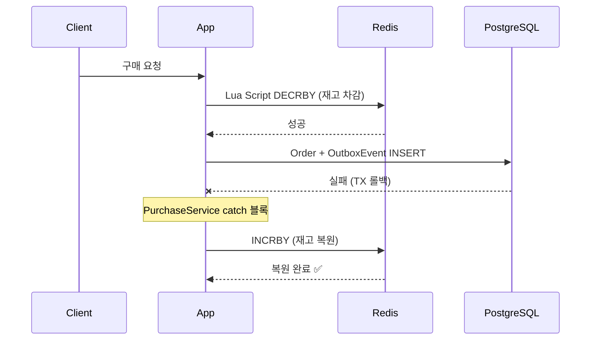
```mermaid
sequenceDiagram
    participant C as Client
    participant App as App
    participant R as Redis
    participant DB as PostgreSQL

    C->>App: 구매 요청
    App->>R: Lua Script DECRBY (재고 차감)
    R-->>App: 성공
    App->>DB: Order + OutboxEvent INSERT
    DB--xApp: 실패 (TX 롤백)

    Note over App: PurchaseService catch 블록
    App->>R: INCRBY (재고 복원)
    R-->>App: 복원 완료 ✅
```

**F1-b. 2차 보상: INCRBY 실패 → CompensationFailure 추적**

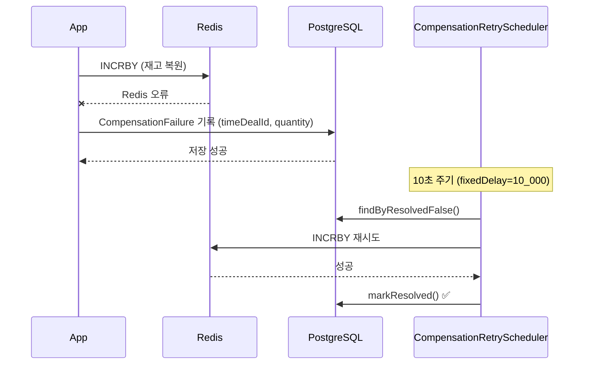
```mermaid
sequenceDiagram
    participant App as App
    participant R as Redis
    participant DB as PostgreSQL
    participant Sch as CompensationRetryScheduler

    App->>R: INCRBY (재고 복원)
    R--xApp: Redis 오류

    App->>DB: CompensationFailure 기록 (timeDealId, quantity)
    DB-->>App: 저장 성공

    Note over Sch: 10초 주기 (fixedDelay=10_000)
    Sch->>DB: findByResolvedFalse()
    Sch->>R: INCRBY 재시도
    R-->>Sch: 성공
    Sch->>DB: markResolved() ✅
```

**F1-c. 3차 보상: DB도 다운 → warm-up + Reconciler**

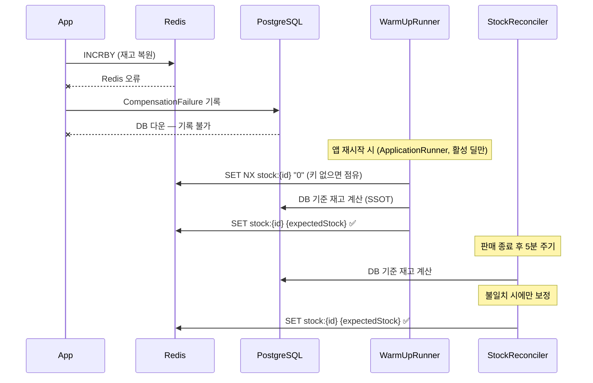
```mermaid
sequenceDiagram
    participant App as App
    participant R as Redis
    participant DB as PostgreSQL
    participant WU as WarmUpRunner
    participant Rec as StockReconciler

    App->>R: INCRBY (재고 복원)
    R--xApp: Redis 오류
    App->>DB: CompensationFailure 기록
    DB--xApp: DB 다운 — 기록 불가

    Note over WU: 앱 재시작 시 (ApplicationRunner, 활성 딜만)
    WU->>R: SET NX stock:{id} "0" (키 없으면 점유)
    WU->>DB: DB 기준 재고 계산 (SSOT)
    WU->>R: SET stock:{id} {expectedStock} ✅

    Note over Rec: 판매 종료 후 5분 주기
    Rec->>DB: DB 기준 재고 계산
    Note over Rec: 불일치 시에만 보정
    Rec->>R: SET stock:{id} {expectedStock} ✅
```

### F2. Redis 실패 + DB 성공

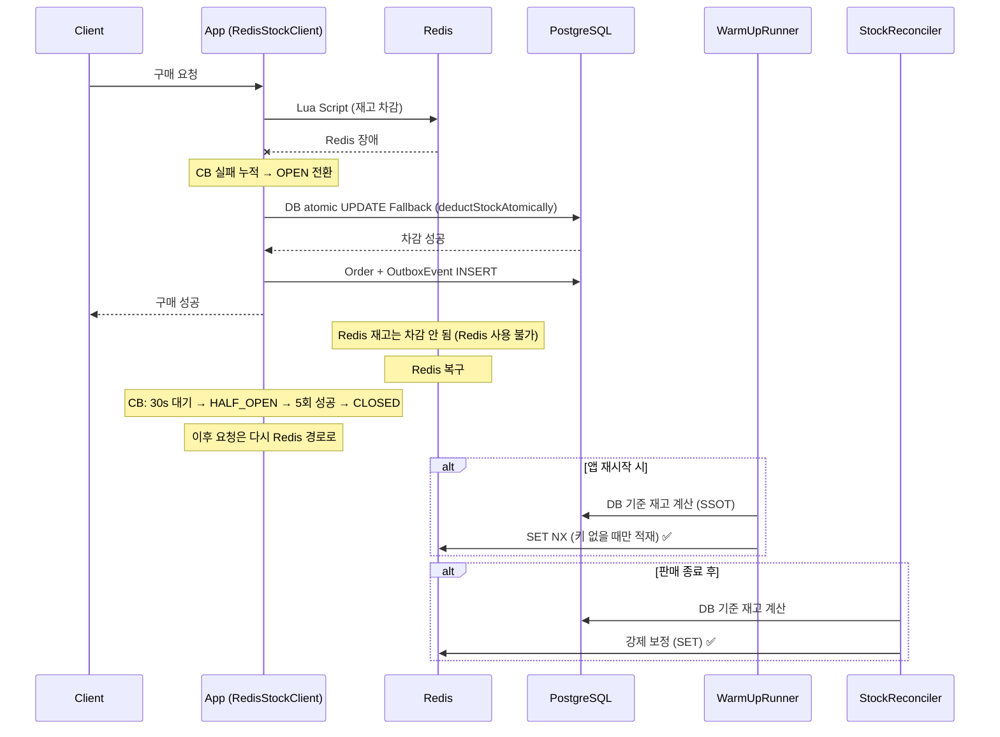
```mermaid
sequenceDiagram
    participant C as Client
    participant App as App (RedisStockClient)
    participant R as Redis
    participant DB as PostgreSQL
    participant WU as WarmUpRunner
    participant Rec as StockReconciler

    C->>App: 구매 요청
    App->>R: Lua Script (재고 차감)
    R--xApp: Redis 장애

    Note over App: CB 실패 누적 → OPEN 전환
    App->>DB: DB atomic UPDATE Fallback (deductStockAtomically)
    DB-->>App: 차감 성공
    App->>DB: Order + OutboxEvent INSERT
    App-->>C: 구매 성공
    Note over R: Redis 재고는 차감 안 됨 (Redis 사용 불가)

    Note over R: Redis 복구
    Note over App: CB: 30s 대기 → HALF_OPEN → 5회 성공 → CLOSED
    Note over App: 이후 요청은 다시 Redis 경로로

    alt 앱 재시작 시
        WU->>DB: DB 기준 재고 계산 (SSOT)
        WU->>R: SET NX (키 없을 때만 적재) ✅
    end

    alt 판매 종료 후
        Rec->>DB: DB 기준 재고 계산
        Rec->>R: 강제 보정 (SET) ✅
    end
```

### F3. 둘 다 성공 + 응답 실패 (클라이언트 재시도)

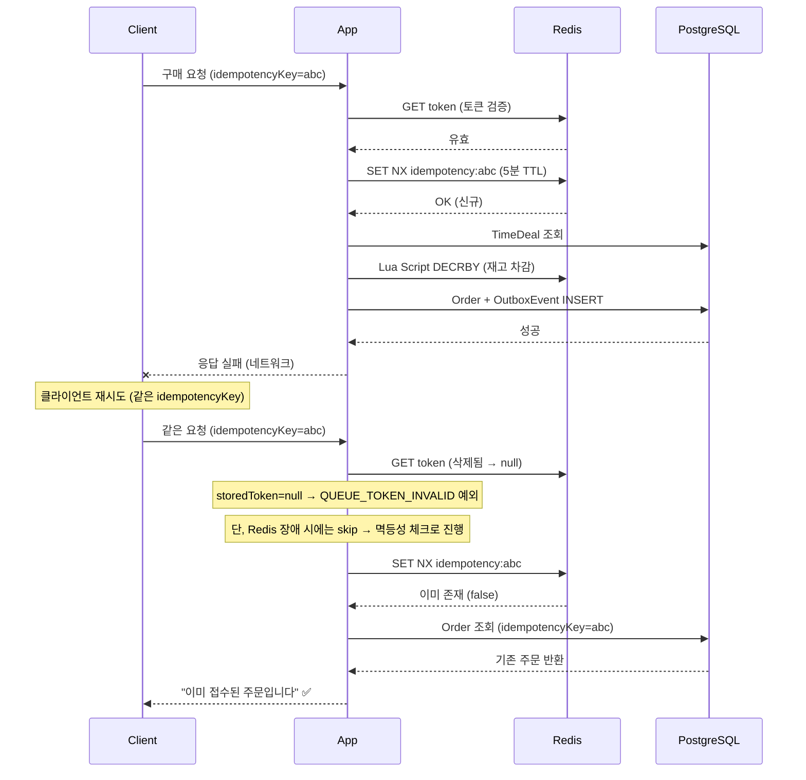
```mermaid
sequenceDiagram
    participant C as Client
    participant App as App
    participant R as Redis
    participant DB as PostgreSQL

    C->>App: 구매 요청 (idempotencyKey=abc)
    App->>R: GET token (토큰 검증)
    R-->>App: 유효
    App->>R: SET NX idempotency:abc (5분 TTL)
    R-->>App: OK (신규)
    App->>DB: TimeDeal 조회
    App->>R: Lua Script DECRBY (재고 차감)
    App->>DB: Order + OutboxEvent INSERT
    DB-->>App: 성공
    App--xC: 응답 실패 (네트워크)

    Note over C: 클라이언트 재시도 (같은 idempotencyKey)
    C->>App: 같은 요청 (idempotencyKey=abc)
    App->>R: GET token (삭제됨 → null)
    Note over App: storedToken=null → QUEUE_TOKEN_INVALID 예외
    Note over App: 단, Redis 장애 시에는 skip → 멱등성 체크로 진행
    App->>R: SET NX idempotency:abc
    R-->>App: 이미 존재 (false)
    App->>DB: Order 조회 (idempotencyKey=abc)
    DB-->>App: 기존 주문 반환
    App-->>C: "이미 접수된 주문입니다" ✅
```

### F4. Redis 자체 장애

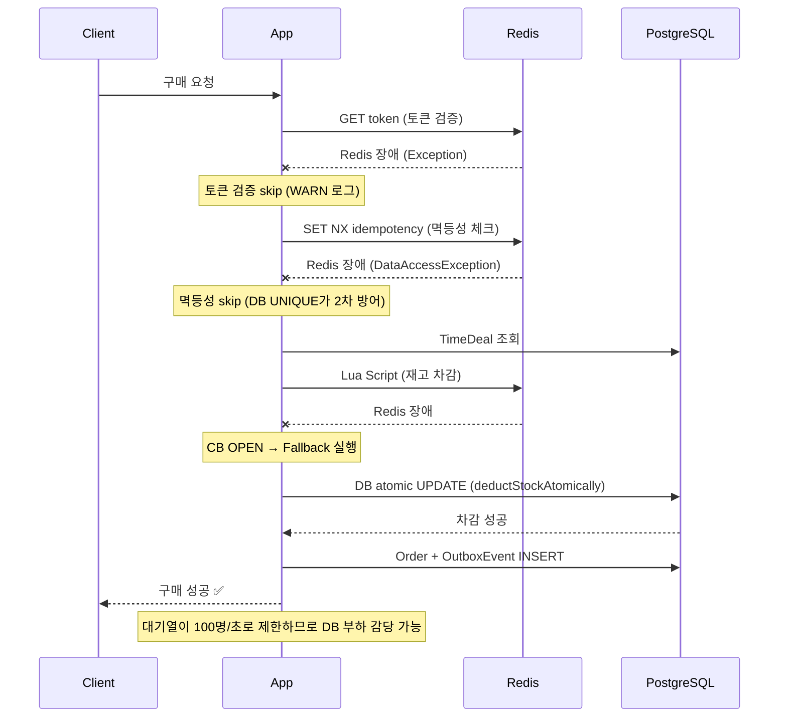
```mermaid
sequenceDiagram
    participant C as Client
    participant App as App
    participant R as Redis
    participant DB as PostgreSQL

    C->>App: 구매 요청
    App->>R: GET token (토큰 검증)
    R--xApp: Redis 장애 (Exception)
    Note over App: 토큰 검증 skip (WARN 로그)

    App->>R: SET NX idempotency (멱등성 체크)
    R--xApp: Redis 장애 (DataAccessException)
    Note over App: 멱등성 skip (DB UNIQUE가 2차 방어)

    App->>DB: TimeDeal 조회
    App->>R: Lua Script (재고 차감)
    R--xApp: Redis 장애
    Note over App: CB OPEN → Fallback 실행
    App->>DB: DB atomic UPDATE (deductStockAtomically)
    DB-->>App: 차감 성공
    App->>DB: Order + OutboxEvent INSERT
    App-->>C: 구매 성공 ✅

    Note over App: 대기열이 100명/초로 제한하므로 DB 부하 감당 가능
```

### F5. Replication Lag

> 발생 안 함: Lua Script는 Master에서 실행, Sentinel 환경에서 Replica 읽기 없음

## 3단계: 주문+결제 (비동기)

### F6. DB 성공 + Kafka 발행 실패

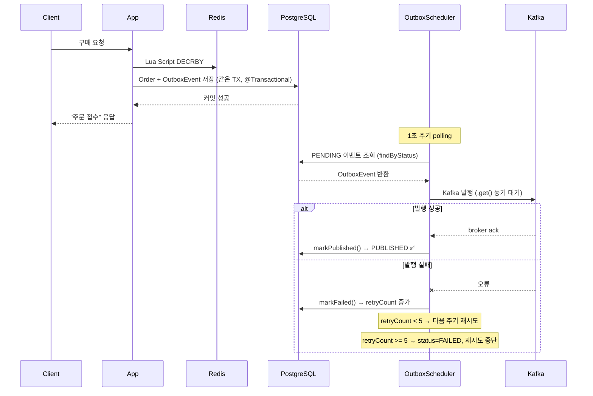
```mermaid
sequenceDiagram
    participant C as Client
    participant App as App
    participant R as Redis
    participant DB as PostgreSQL
    participant Sch as OutboxScheduler
    participant K as Kafka

    C->>App: 구매 요청
    App->>R: Lua Script DECRBY
    App->>DB: Order + OutboxEvent 저장 (같은 TX, @Transactional)
    DB-->>App: 커밋 성공
    App-->>C: "주문 접수" 응답

    Note over Sch: 1초 주기 polling
    Sch->>DB: PENDING 이벤트 조회 (findByStatus)
    DB-->>Sch: OutboxEvent 반환
    Sch->>K: Kafka 발행 (.get() 동기 대기)

    alt 발행 성공
        K-->>Sch: broker ack
        Sch->>DB: markPublished() → PUBLISHED ✅
    else 발행 실패
        K--xSch: 오류
        Sch->>DB: markFailed() → retryCount 증가
        Note over Sch: retryCount < 5 → 다음 주기 재시도
        Note over Sch: retryCount >= 5 → status=FAILED, 재시도 중단
    end
```

### F7. Kafka Consumer 처리 실패

**F7-a. 정상 경로: PG 성공 → 주문 확정**

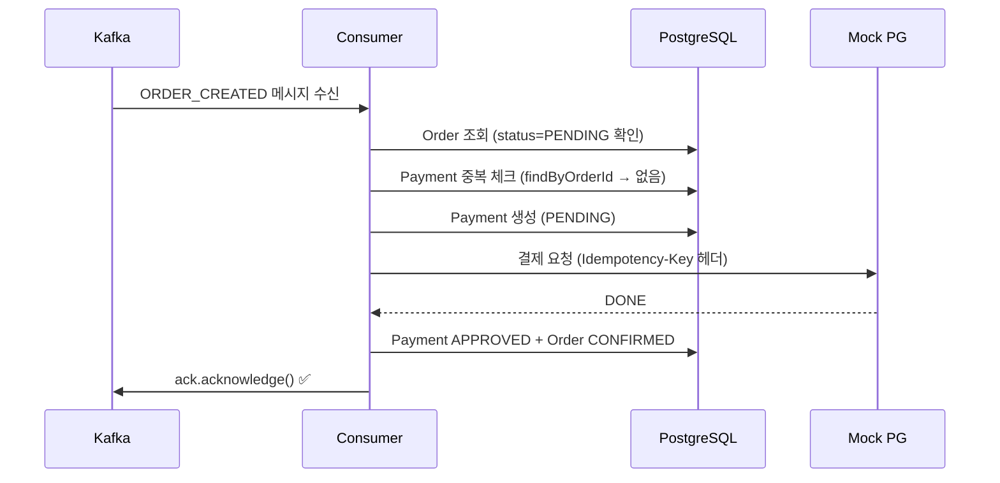
```mermaid
sequenceDiagram
    participant K as Kafka
    participant Con as Consumer
    participant DB as PostgreSQL
    participant PG as Mock PG

    K->>Con: ORDER_CREATED 메시지 수신
    Con->>DB: Order 조회 (status=PENDING 확인)
    Con->>DB: Payment 중복 체크 (findByOrderId → 없음)
    Con->>DB: Payment 생성 (PENDING)
    Con->>PG: 결제 요청 (Idempotency-Key 헤더)
    PG-->>Con: DONE
    Con->>DB: Payment APPROVED + Order CONFIRMED
    Con->>K: ack.acknowledge() ✅
```

**F7-b. PG 명시적 거절 → 취소 + 재고 복원**

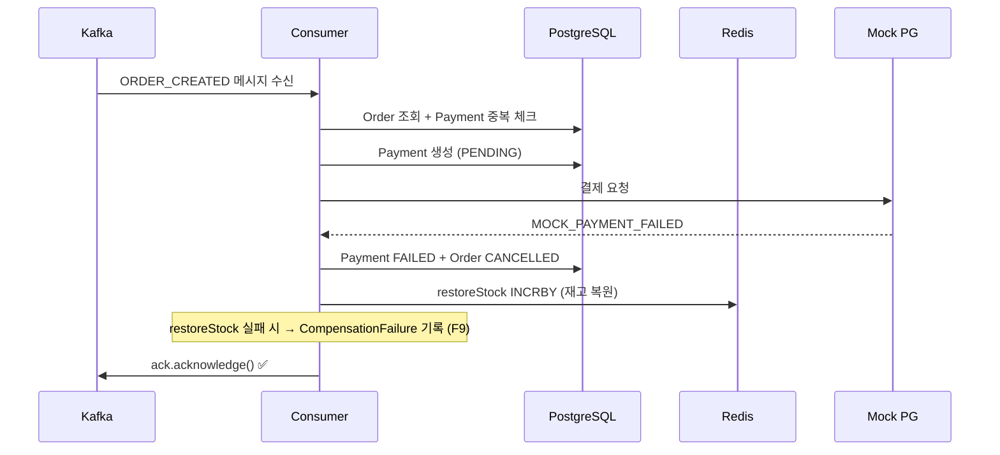
```mermaid
sequenceDiagram
    participant K as Kafka
    participant Con as Consumer
    participant DB as PostgreSQL
    participant R as Redis
    participant PG as Mock PG

    K->>Con: ORDER_CREATED 메시지 수신
    Con->>DB: Order 조회 + Payment 중복 체크
    Con->>DB: Payment 생성 (PENDING)
    Con->>PG: 결제 요청
    PG-->>Con: MOCK_PAYMENT_FAILED
    Con->>DB: Payment FAILED + Order CANCELLED
    Con->>R: restoreStock INCRBY (재고 복원)
    Note over Con: restoreStock 실패 시 → CompensationFailure 기록 (F9)
    Con->>K: ack.acknowledge() ✅
```

**F7-c. PG 타임아웃 → PENDING 유지**

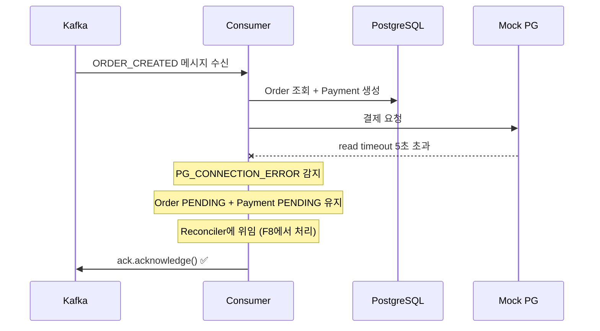
```mermaid
sequenceDiagram
    participant K as Kafka
    participant Con as Consumer
    participant DB as PostgreSQL
    participant PG as Mock PG

    K->>Con: ORDER_CREATED 메시지 수신
    Con->>DB: Order 조회 + Payment 생성
    Con->>PG: 결제 요청
    PG--xCon: read timeout 5초 초과
    Note over Con: PG_CONNECTION_ERROR 감지
    Note over Con: Order PENDING + Payment PENDING 유지
    Note over Con: Reconciler에 위임 (F8에서 처리)
    Con->>K: ack.acknowledge() ✅
```

**F7-d. Consumer 처리 중 예외 → 자동 재전송**

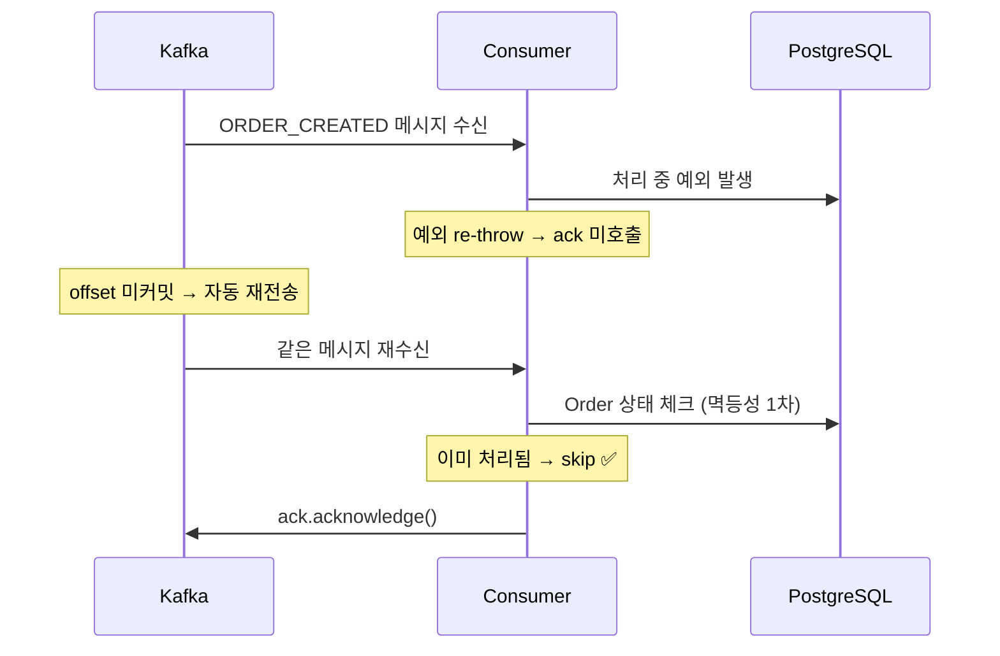
```mermaid
sequenceDiagram
    participant K as Kafka
    participant Con as Consumer
    participant DB as PostgreSQL

    K->>Con: ORDER_CREATED 메시지 수신
    Con->>DB: 처리 중 예외 발생
    Note over Con: 예외 re-throw → ack 미호출
    Note over K: offset 미커밋 → 자동 재전송

    K->>Con: 같은 메시지 재수신
    Con->>DB: Order 상태 체크 (멱등성 1차)
    Note over Con: 이미 처리됨 → skip ✅
    Con->>K: ack.acknowledge()
```

**F7-e. 멱등성 — 중복 메시지 수신**

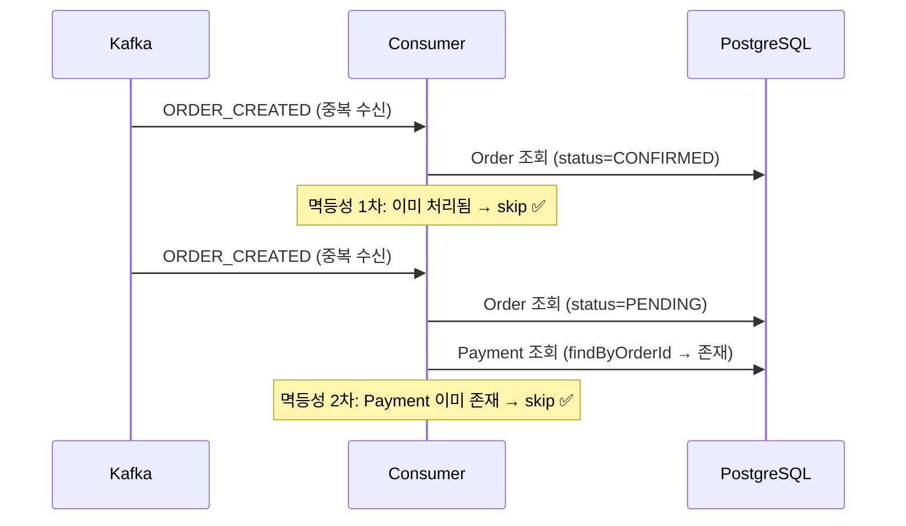
```mermaid
sequenceDiagram
    participant K as Kafka
    participant Con as Consumer
    participant DB as PostgreSQL

    K->>Con: ORDER_CREATED (중복 수신)
    Con->>DB: Order 조회 (status=CONFIRMED)
    Note over Con: 멱등성 1차: 이미 처리됨 → skip ✅

    K->>Con: ORDER_CREATED (중복 수신)
    Con->>DB: Order 조회 (status=PENDING)
    Con->>DB: Payment 조회 (findByOrderId → 존재)
    Note over Con: 멱등성 2차: Payment 이미 존재 → skip ✅
```

### F8. PG 결제 결과 불확실 (타임아웃) — Reconciler 사후 처리

> PendingOrderReconciler: 5분 주기, PENDING 10분 초과 주문 스캔

**F8-a. Payment 레코드 없음 → Consumer 미처리 → 취소**

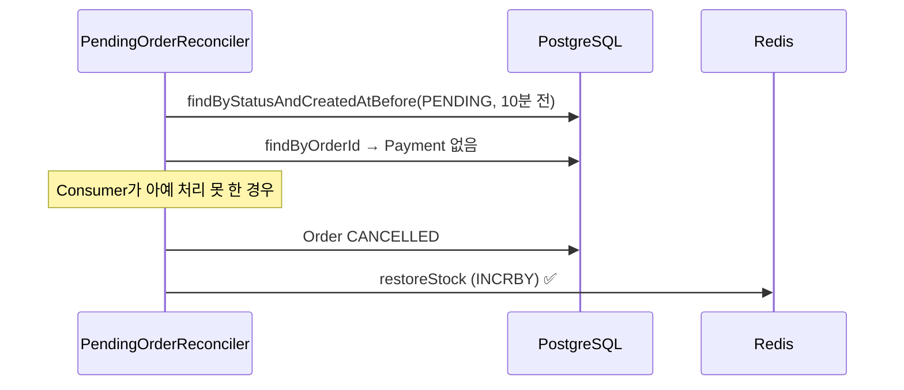
```mermaid
sequenceDiagram
    participant Rec as PendingOrderReconciler
    participant DB as PostgreSQL
    participant R as Redis

    Rec->>DB: findByStatusAndCreatedAtBefore(PENDING, 10분 전)
    Rec->>DB: findByOrderId → Payment 없음
    Note over Rec: Consumer가 아예 처리 못 한 경우
    Rec->>DB: Order CANCELLED
    Rec->>R: restoreStock (INCRBY) ✅
```

**F8-b. pgPaymentKey 존재 → PG 조회로 확정/취소**

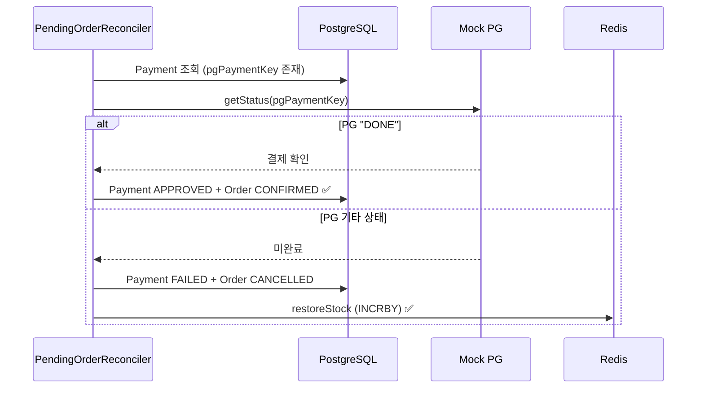
```mermaid
sequenceDiagram
    participant Rec as PendingOrderReconciler
    participant DB as PostgreSQL
    participant PG as Mock PG
    participant R as Redis

    Rec->>DB: Payment 조회 (pgPaymentKey 존재)
    Rec->>PG: getStatus(pgPaymentKey)

    alt PG "DONE"
        PG-->>Rec: 결제 확인
        Rec->>DB: Payment APPROVED + Order CONFIRMED ✅
    else PG 기타 상태
        PG-->>Rec: 미완료
        Rec->>DB: Payment FAILED + Order CANCELLED
        Rec->>R: restoreStock (INCRBY) ✅
    end
```

**F8-c. pgPaymentKey 없음 (타임아웃) → orderId로 PG 조회**

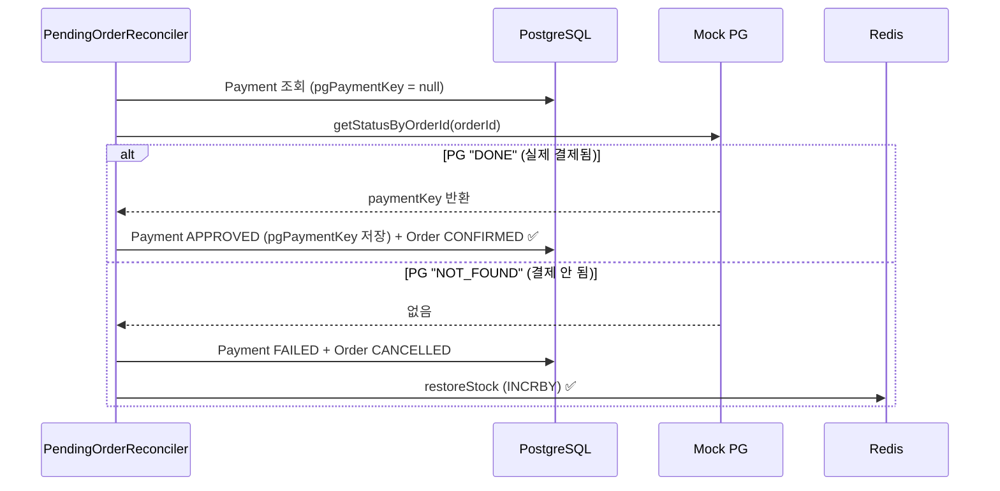
```mermaid
sequenceDiagram
    participant Rec as PendingOrderReconciler
    participant DB as PostgreSQL
    participant PG as Mock PG
    participant R as Redis

    Rec->>DB: Payment 조회 (pgPaymentKey = null)
    Rec->>PG: getStatusByOrderId(orderId)

    alt PG "DONE" (실제 결제됨)
        PG-->>Rec: paymentKey 반환
        Rec->>DB: Payment APPROVED (pgPaymentKey 저장) + Order CONFIRMED ✅
    else PG "NOT_FOUND" (결제 안 됨)
        PG-->>Rec: 없음
        Rec->>DB: Payment FAILED + Order CANCELLED
        Rec->>R: restoreStock (INCRBY) ✅
    end
```

### F9. 보상 트랜잭션 실패

> restoreStock(INCRBY) 호출 지점: PurchaseService(F1), Consumer(F7-b), Reconciler(F8)

**F9-a. 보상 성공**

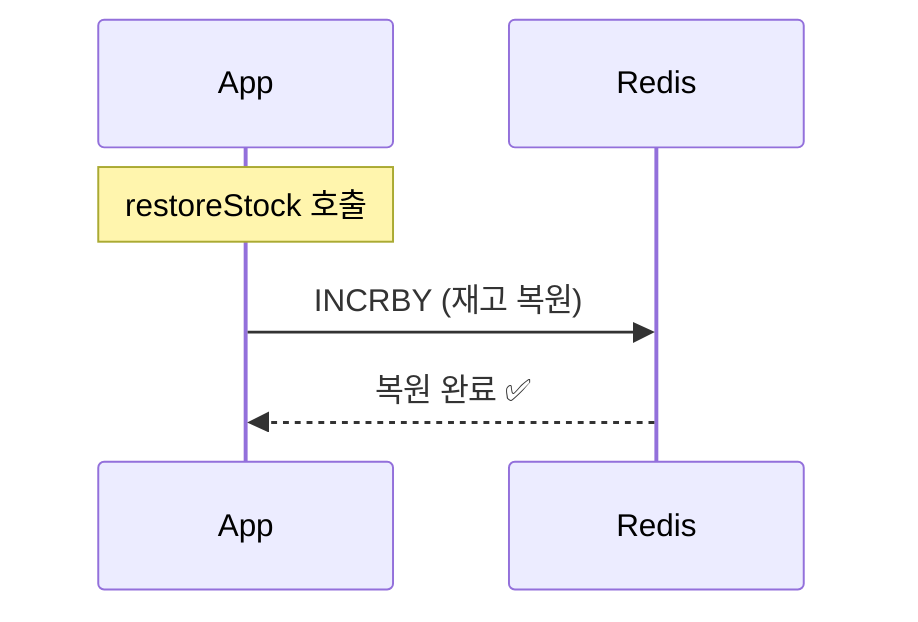
```mermaid
sequenceDiagram
    participant App as App
    participant R as Redis

    Note over App: restoreStock 호출
    App->>R: INCRBY (재고 복원)
    R-->>App: 복원 완료 ✅
```

**F9-b. INCRBY 실패 → CompensationFailure 추적 + Scheduler 재시도**

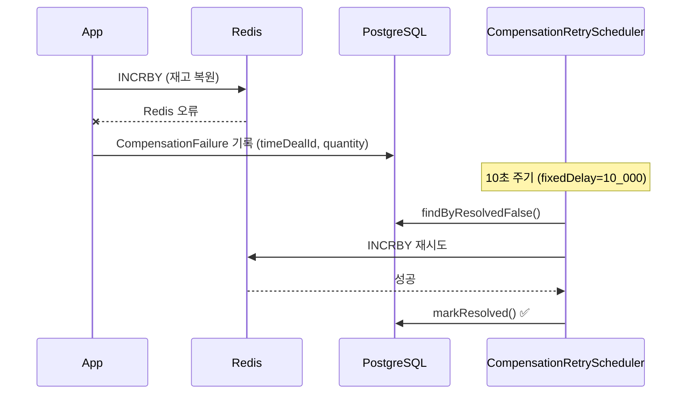
```mermaid
sequenceDiagram
    participant App as App
    participant R as Redis
    participant DB as PostgreSQL
    participant Sch as CompensationRetryScheduler

    App->>R: INCRBY (재고 복원)
    R--xApp: Redis 오류
    App->>DB: CompensationFailure 기록 (timeDealId, quantity)

    Note over Sch: 10초 주기 (fixedDelay=10_000)
    Sch->>DB: findByResolvedFalse()
    Sch->>R: INCRBY 재시도
    R-->>Sch: 성공
    Sch->>DB: markResolved() ✅
```

**F9-c. DB도 다운 → warm-up + Reconciler**

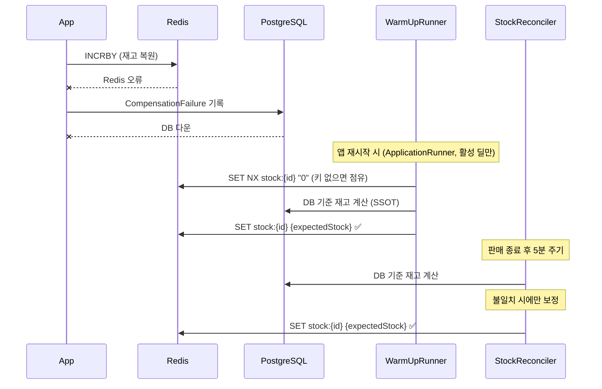
```mermaid
sequenceDiagram
    participant App as App
    participant R as Redis
    participant DB as PostgreSQL
    participant WU as WarmUpRunner
    participant Rec as StockReconciler

    App->>R: INCRBY (재고 복원)
    R--xApp: Redis 오류
    App->>DB: CompensationFailure 기록
    DB--xApp: DB 다운

    Note over WU: 앱 재시작 시 (ApplicationRunner, 활성 딜만)
    WU->>R: SET NX stock:{id} "0" (키 없으면 점유)
    WU->>DB: DB 기준 재고 계산 (SSOT)
    WU->>R: SET stock:{id} {expectedStock} ✅

    Note over Rec: 판매 종료 후 5분 주기
    Rec->>DB: DB 기준 재고 계산
    Note over Rec: 불일치 시에만 보정
    Rec->>R: SET stock:{id} {expectedStock} ✅
```

## 횡단: 3계층 정합성 방어

```
1층: 실시간 보상 (INCRBY)                → 99% 커버
2층: CompensationFailure 추적 + 재시도    → 보상 실패 시
3층: warm-up(SET NX) + 종료 후 Reconciler → 앱 크래시, DB 다운, Redis Failover
```
